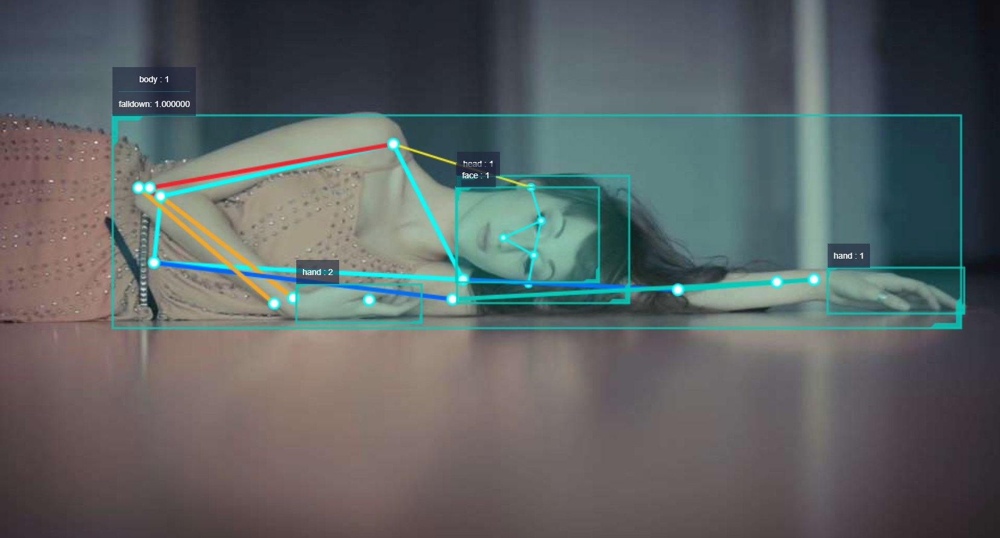

# 4.3 Pose Detection

## Function Introduction

The Pose Detection App subscribes to the image messages published by the camera, detects key points of the human body, analyzes the body posture, and publishes pose events.

Pose events are published using a custom algorithm message. Users can subscribe to the msg of this topic for application development.

Currently, only fall detection function is supported, which detects whether a person falls.

Code Repository: <https://github.com/HorizonRDK/hobot_falldown_detection>

## Supported Platforms

| Platform     | Operation     | Example Function                       |
| -------- | ------------ | ------------------------------ |
| RDK X3, RDK X3 Module, RDK UltraUbuntu 20.04 | Start MIPI/USB camera to capture images, perform human body key point detection and pose detection, and finally display images and algorithm effects through web, and publish pose events |

## Preparation

### Horizon RDK Platform

1. Horizon RDK has burned the Ubuntu 20.04 image provided by Horizon.

2. The TogetheROS.Bot has been successfully installed on the Horizon RDK.

3. Make sure the PC is in the same network segment as the Horizon RDK, and the IP address of the first three segments should be consistent.

4. The Horizon RDK has installed MIPI or USB cameras.

## Usage Introduction

### Horizon RDK Platform

The pose detection package subscribes to the data published by the human body key point detection package, publishes algorithm messages after algorithm inference, and uses the websocket package to render and display the published images and corresponding algorithm results on the PC browser.

Friendly reminder: When experiencing the App, rotate the camera by 90 degrees to simulate the effect of a person falling.

**Publish images using MIPI camera**

```shell
# Configure the tros.b environment
source /opt/tros/setup.bash

# Copy the required configuration files from the installation path of tros.b
cp -r /opt/tros/lib/mono2d_body_detection/config/ .# Configure MIPI camera 
export CAM_TYPE=mipi

# Launch the launch file
ros2 launch hobot_falldown_detection hobot_falldown_detection.launch.py

**Publish images using USB camera**

```shell
# Configure tros.b environment
source /opt/tros/setup.bash

# Copy the necessary configuration files from the installation path of tros.b for running the example.
cp -r /opt/tros/lib/mono2d_body_detection/config/ .

# Configure the USB camera
export CAM_TYPE=usb

# Launch the launch file
ros2 launch hobot_falldown_detection hobot_falldown_detection.launch.py
```

For the explanation of the parameters in the command, please refer to the README.md in the hobot_falldown_detection package source code.

## Result analysis

After starting the pose detection package, the following information will be displayed in the terminal:

```shell
[hobot_falldown_detection-4] [INFO] [1660271558.250055538] [body_kps_Subscriber]: receive targetType: personpointType: body_kps
[hobot_falldown_detection-4] [INFO] [1660271558.250598996] [fall_down_publisher]: track_id: 1 is fall down
```

The output log shows that the body_kps data is subscribed and the pose event is published.

In the PC's browser, enter `<http://IP:8000>`, and the body detection frame, keypoints, and pose detection results will be displayed in the web interface (IP refers to the IP address of the Horizon RDK):

