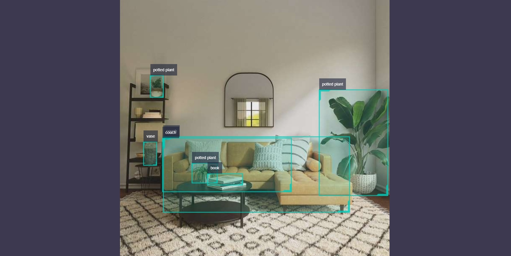

# FCOS

## Introduction

The FCOS target detection algorithm example uses images as input and utilizes BPU for algorithm inference, resulting in the publication of intelligent messages containing target categories and detection boxes.

FCOS is an open-source Onnx model developed by Horizon, trained using the [COCO dataset](http://cocodataset.org/). It supports various types of object detection, including humans, animals, fruits, and vehicles, totaling 80 types.

Code repository: <https://github.com/HorizonRDK/hobot_dnn>

Application scenarios: Released in 2019, FCOS is a one-stage object detection algorithm capable of pedestrian and vehicle detection. It is mainly used in autonomous driving and smart home fields.

Multispectral object detection example: <https://github.com/hdjsjyl/Multispectral-FCOS>

## Supported Platforms

| Platform          | Operating System | Example Functionality                                       |
| ----------------- | ---------------- | ----------------------------------------------------------- |
| RDK X3, RDK X3 Module | Ubuntu 20.04       | - Launch MIPI/USB camera and display inference rendering via web interface<br/>- Use local feedback to save rendering results locally |
| X86               | Ubuntu 20.04       | - Use local feedback to save rendering results locally         |

## Preparation

### Horizon RDK Platform

1. The Horizon RDK platform is flashed with the Ubuntu 20.04 system image provided by Horizon.

2. TogetheROS.Bot has been successfully installed on the Horizon RDK platform.

3. A MIPI or USB camera has been installed on the Horizon RDK platform. If no camera is available, the algorithm effects can be experienced through local feedback using JPEG/PNG format images or MP4, H.264, and H.265 video.

4. Ensure that the PC can access the Horizon RDK platform via the network.

### X86 Platform

1. The X86 environment has been configured with the Ubuntu 20.04 system image.

2. The X86 environment has successfully installed tros.b.

## User Guide

### Horizon RDK Platform

#### Publishing Images Using a MIPI Camera

The FCOS target detection algorithm example subscribes to images published by the sensor package, performs inference, and publishes algorithm messages. The WebSocket package is used to render and display the published images and their corresponding algorithm results on a PC web browser.

```shell
# Configure tros.b environment
source /opt/tros/setup.bash

# Configure MIPI camera
export CAM_TYPE=mipi

# Launch the launch file
ros2 launch dnn_node_example dnn_node_example.launch.py dnn_example_config_file:=config/fcosworkconfig.json dnn_example_image_width:=480 dnn_example_image_height:=272
```

#### Use USB camera to publish images

```shell
# Configure tros.b environment
source /opt/tros/setup.bash

# Configure USB camera
export CAM_TYPE=usb

# Launch the launch file
ros2 launch dnn_node_example dnn_node_example.launch.py dnn_example_config_file:=config/fcosworkconfig.json dnn_example_image_width:=480 dnn_example_image_height:=272
```

#### Use local images for feedback

The FCOS object detection algorithm example uses local JPEG/PNG format images for feedback. The inferred images with algorithm results are stored in the running path.

```shell
# Configure tros.b environment
source /opt/tros/setup.bash

# Launch the launch file
ros2 launch dnn_node_example dnn_node_example_feedback.launch.py dnn_example_config_file:=config/fcosworkconfig.json dnn_example_image:=config/target.jpg
```

### X86 Platform

#### Use local images for feedback

The FCOS object detection algorithm example uses local JPEG/PNG format images for feedback. The inferred images with algorithm results are stored in the local running path.

```shell
# Configure tros.b environment
source /opt/tros/setup.bash

# Launch the launch file
ros2 launch dnn_node_example dnn_node_example_feedback.launch.py dnn_example_config_file:=config/fcosworkconfig.json dnn_example_image:=config/target.jpg
```

## Result Analysis

### Publishing Images Using a Camera

The terminal output shows the following information:

```text
[example-3] [WARN] [1655092908.847609539] [example]: Create ai msg publisher with topic_name: hobot_dnn_detection
[example-3] [WARN] [1655092908.849393011] [example]: Create img hbmem_subscription with topic_name: /hbmem_img
[example-3] [WARN] [1655092543.834432739] [img_sub]: Sub img fps 31.16
[example-3] [WARN] [1655092543.864126080] [example]: Smart fps 31.56
[example-3] [WARN] [1655092544.867603759] [img_sub]: Sub img fps 30.01
[example-3] [WARN] [1655092544.899715339] [example]: Smart fps 29.95
[example-3] [WARN] [1655092545.900991853] [img_sub]: Sub img fps 30.01
[example-3] [WARN] [1655092545.931518037] [example]: Smart fps 30.07
[example-3] [WARN] [1655092546.901658559] [img_sub]: Sub img fps 30.00
[example-3] [WARN] [1655092546.938970895] [example]: Smart fps 29.79
[example-3] [WARN] [1655092547.934894494] [img_sub]: Sub img fps 30.01
[example-3] [WARN] [1655092547.973566486] [example]: Smart fps 29.98
[example-3] [WARN] [1655092548.967549745] [img_sub]: Sub img fps 30.10
[example-3] [WARN] [1655092548.997125216] [example]: Smart fps 30.30

```

The log output shows that the topic for publishing the algorithm inference results is `hobot_dnn_detection`, and the topic for subscribing to images is `/hbmem_img`. The frame rate of the subscribed images and algorithm inference output is approximately 30fps.

To view the image and algorithm rendering effect on the PC browser, enter http://IP:8000 (where IP is the IP address of the Horizon RDK):



### Feedback Using Local Images

The terminal output shows the following information:

```text
[example-1] [INFO] [1654766336.839353395] [PostProcessBase]: out box size: 6
[example-1] [INFO] [1654766336.839427767] [PostProcessBase]: det rect: 87.2364 259.123 409.917 371.59, det type: couch, score:0.782941
[example-1] [INFO] [1654766336.839523764] [PostProcessBase]: det rect: 374.212 175.732 510.993 375.211, det type: potted plant, score:0.719925
[example-1] [INFO] [1654766336.839597637] [PostProcessBase]: det rect: 167.183 335.857 234.13 355.308, det type: book, score:0.548071
[example-1] [INFO] [1654766336.839671426] [PostProcessBase]: det rect: 139.87 313.279 183.4 352.292, det type: potted plant, score:0.542984
[example-1] [INFO] [1654766336.839738966] [PostProcessBase]: det rect: 57.9695 148.59 83.5923 186.552, det type: potted plant, score:0.502935
[example-1] [INFO] [1654766336.839823755] [PostProcessBase]: det rect: 165.691 339.25 237.475 366.896, det type: book, score:0.500648
```

The log output shows that the algorithm infers 6 targets from the input image and outputs the coordinates of the detection boxes (the coordinates are in the order of the top left x and y coordinates of the bounding box, and the bottom right x and y coordinates) and their corresponding classes. The rendered image file is named render_feedback_0_0.jpeg, and the rendered image effect is as follows:

