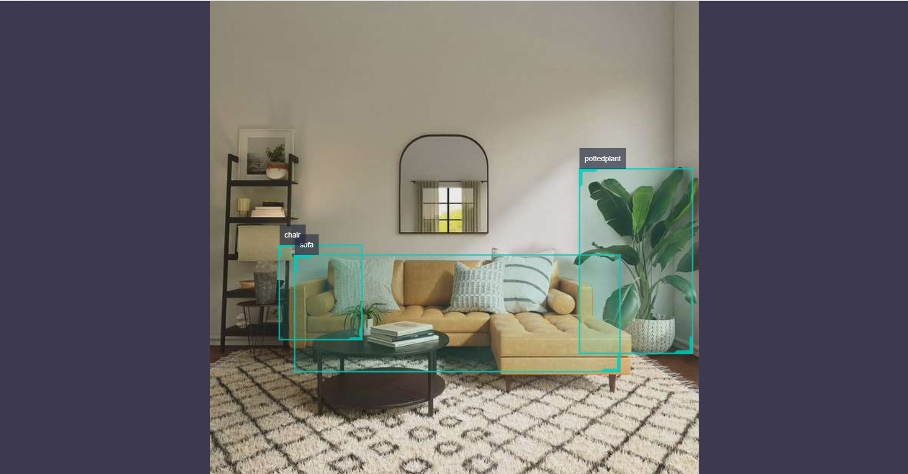

# MobileNet_SSD

## Function Introduction

The MobileNet_SSD object detection algorithm example uses images as input, performs algorithm inference using BPU, and publishes algorithm messages that include target categories and detection boxes.

MobileNet_SSD is a caffe model obtained from <https://github.com/chuanqi305/MobileNet-SSD>, trained using the VOC dataset (http://host.robots.ox.ac.uk/pascal/VOC/voc2012/). It supports 20 types of target detection, including humans, animals, fruits, and vehicles.

Code repository: <https://github.com/HorizonRDK/hobot_dnn>

Application scenarios: MobileNet_SSD is an object detection algorithm based on MobileNet, which has the advantages of fast speed and easy deployment. It can achieve functions such as object detection and garbage recognition, and is mainly used in the fields of autonomous driving and smart home.

Face detection example: <https://github.com/bruceyang2012/Face-detection-with-mobilenet-ssd>
License plate detection example: <https://github.com/soonhahwang/Mobilenet-SSD-to-detect-Licence-Plate>

## Supported Platforms

| Platform                 | Operating Method | Example Function                                             |
| ------------------------ | ---------------- | ------------------------------------------------------------ |
| RDK X3, RDK X3 Module    | Ubuntu 20.04     | · Start the MIPI/USB camera and display the inference rendering results through the web<br/>· Use local feedback to save the rendering results locally |
| X86                      | Ubuntu 20.04     | · Use local feedback to save the rendering results locally   |

## Preparation

### Horizon RDK Platform

1. Horizon RDK has burned the Ubuntu 20.04 system image provided by Horizon.

2. Horizon RDK has successfully installed TogetheROS.Bot.

3. Horizon RDK has installed a MIPI or USB camera. In the absence of a camera, the algorithm effect can be experienced by feeding back local JPEG/PNG format images or MP4, H.264, and H.265 videos.

4. Confirm that the PC can access the Horizon RDK through the network.

### X86 Platform

1. The X86 environment has been configured with the Ubuntu 20.04 system image.

2. The X86 environment system has successfully installed tros.b.

## User Guide

### Horizon RDK Platform

#### Publish Images using MIPI Camera

The MobileNet_SSD object detection algorithm example subscribes to the images published by the sensor package, performs inference, and publishes algorithm messages. The algorithm messages and corresponding images are rendered and displayed on the PC browser using the websocket package.

```shell
# Configure the tros.b environment
source /opt/tros/setup.bash

# Configure the MIPI camera
export CAM_TYPE=mipi

# Start the launch file
ros2 launch dnn_node_example dnn_node_example.launch.py dnn_example_config_file:=config/mobilenet_ssd_workconfig.json dnn_example_image_width:=480 dnn_example_image_height:=272
```

#### Publish Images from USB Camera

```shell
# Configure the tros.b environment
source /opt/tros/setup.bash

# Configure the USB camera
export CAM_TYPE=usb

# Start the launch file
ros2 launch dnn_node_example dnn_node_example.launch.py dnn_example_config_file:=config/mobilenet_ssd_workconfig.json dnn_example_image_width:=480 dnn_example_image_height:=272
```

#### Use Local Images for Feedback

The MobileNet_SSD object detection algorithm example uses local JPEG/PNG format images for feedback. After inference, the algorithm results with rendered images are stored in the local runtime path.

```shell
# Configure the tros.b environment
source /opt/tros/setup.bash

# Start the launch file
ros2 launch dnn_node_example dnn_node_example_feedback.launch.py dnn_example_config_file:=config/mobilenet_ssd_workconfig.json dnn_example_image:=config/target.jpg
```

### X86 Platform

#### Use Local Images for Feedback

The MobileNet_SSD object detection algorithm example uses local JPEG/PNG format images for feedback. After running the inference, the algorithm results with rendered images are stored in the local runtime path.

```shell
# Configure the tros.b environment
source /opt/tros/setup.bash

# Start the launch file
ros2 launch dnn_node_example dnn_node_example_feedback.launch.py dnn_example_config_file:=config/mobilenet_ssd_workconfig.json dnn_example_image:=config/target.jpg
```

## Result Analysis

### Publish Images Using Camera

The following information is displayed in the terminal output:

```shell
[example-3] [WARN] [1655095279.473675326] [example]: Create ai msg publisher with topic_name: hobot_dnn_detection
[example-3] [WARN] [1655095279.473789113] [example]: Create img hbmem_subscription with topic_name: /hbmem_img
[example-3] [WARN] [1655095280.697388819] [img_sub]: Sub img fps 31.16
[example-3] [WARN] [1655095280.710505278] [example]: Smart fps 31.50
[example-3] [WARN] [1655095281.697831409] [img_sub]: Sub img fps 30.00
[example-3] [WARN] [1655095281.743811574] [example]: Smart fps 30.01
[example-3] [WARN] [1655095282.730768103] [img_sub]: Sub img fps 30.04
[example-3] [WARN] [1655095282.744084511] [example]: Smart fps 30.00
```

The output log shows that the topic for publishing algorithm inference results is `hobot_dnn_detection`, and the topic for subscribing to images is `/hbmem_img`. The frame rate of the subscribed images and the algorithm inference output is approximately 30fps.

To view the image and algorithm rendering effects, input http://IP:8000 in the browser on the PC (where IP is the IP address of the Horizon RDK):



### Feedback with Local Images

The following information is displayed in the terminal output:

```shell
[example-1] [INFO] [1654930510.201326806] [example]: Output from image_name: config/target.jpg, frame_id: feedback, stamp: 0.0
[example-1] [INFO] [1654930510.201485092] [PostProcessBase]: outputs size: 12
[example-1] [INFO] [1654930510.201581047] [PostProcessBase]: out box size: 2
[example-1] [INFO] [1654930510.201672794] [PostProcessBase]: det rect: 227.27 101.873 299.219 223.667, det type: pottedplant, score:0.995207
[example-1] [INFO] [1654930510.201778415] [PostProcessBase]: det rect: 62.3792 155.731 221.676 223.179, det type: sofa, score:0.982129
```

The output log shows that the algorithm infers 2 targets from the input image and outputs the coordinates of the detected bounding boxes (the order of the output coordinates is the top-left x and y coordinates of the human bounding box, and the bottom-right x and y coordinates) and the class. The rendered image file is named render_feedback_0_0.jpeg, and the rendering effect is:

