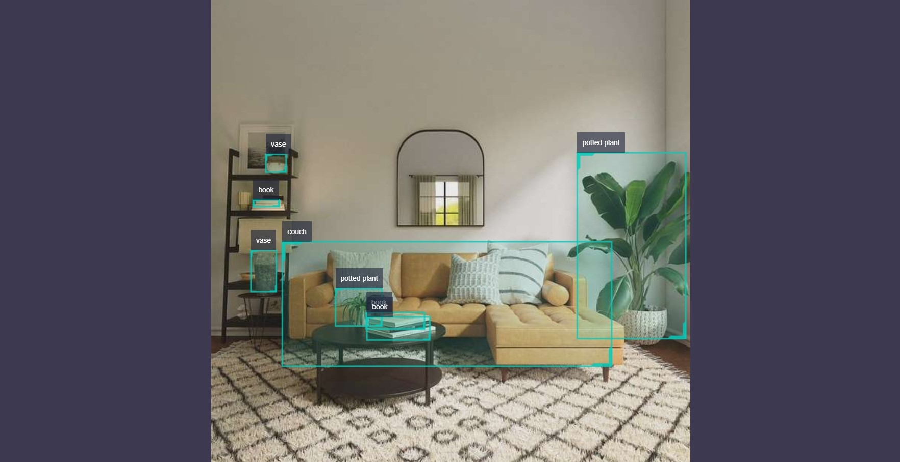

# YOLO

## Introduction

YOLO object detection algorithm example uses images as input, performs algorithm inference using BPU, and publishes algorithm messages containing object categories and detection boxes. Currently, it supports four versions: yolov2, yolov3, yolov5, and yolov5x.

The model is trained using the [COCO dataset](http://cocodataset.org/), and the supported object detection types include humans, animals, fruits, and vehicles, totaling 80 types.

Code repository: <https://github.com/HorizonRDK/hobot_dnn>

Use cases: As a representative algorithm in single-stage object detection, the YOLO series has the advantages of fast speed and good generalization, and can be used for garbage recognition, vehicle detection, and other functions, mainly applied in autonomous driving, smart home, and other fields.

Vehicle detection example: <https://github.com/JunshengFu/vehicle-detection>  
Fall detection example: <https://github.com/xiaobin1231/Fall-Detection-By-YOLOV3-and-LiteFlowNet>

## Supported Platforms

| Platform              | Operating System | Supported Algorithms | Example Functions                                            |
| --------------------- | ---------------- | -------------------- | ------------------------------------------------------------ |
| RDK X3, RDK X3 Module | Ubuntu 20.04     | yolov2/yolov3/yolov5 | · Start MIPI/USB cameras and display inference rendering results through web<br/>· Use local over-the-air return, and save rendering results locally |
| RDK Ultra             | Ubuntu 20.04     | yolov5x              | · Start MIPI/USB cameras and display inference rendering results through web<br/>· Use local over-the-air return, and save rendering results locally |
| X86                   | Ubuntu 20.04     | yolov2/yolov3        | · Use local over-the-air return, and save rendering results locally |

## Preparations

### Horizon RDK Platform

1. Horizon RDK has been burned with the Ubuntu 20.04 system image provided by Horizon.

2. Horizon RDK has successfully installed TogetheROS.Bot.

3. Horizon RDK has installed MIPI or USB cameras. In the absence of a camera, the algorithm effect can be experienced by over-the-air returning local JPEG/PNG format images or MP4, H.264, and H.265 videos.

4. Confirm that the PC can access the Horizon RDK through the network.

### X86 Platform

1. X86 environment has been configured with the Ubuntu 20.04 system image.

2. X86 environment has successfully installed tros.b.

## Usage Instructions

### Horizon RDK X3 and RDK X3 Module Platforms

#### Publish Images Using MIPI Cameras# YOLOv2 Object Detection Algorithm Example Subscribes to Images Published by MIPI Camera and Publish Algorithm Msg After Algorithm Inference. It Renders and Displays Published Images and Corresponding Algorithm Results on PC-side Browsers through the Websocket Package.

```shell
# Configure the tros.b environment
source /opt/tros/setup.bash

# Configure the MIPI camera
export CAM_TYPE=mipi

# Launch the launch file
ros2 launch dnn_node_example dnn_node_example.launch.py dnn_example_config_file:=config/yolov2workconfig.json dnn_example_image_width:=480 dnn_example_image_height:=272
```

#### Publish Images using USB Camera

YOLOv2 Object Detection Algorithm Example Subscribes to Images Published by USB Camera, Publishes Algorithm Msg After Algorithm Inference, and Renders and Displays Published Images and Corresponding Algorithm Results on PC-side Browsers through the Websocket Package.

```shell
# Configure the tros.b environment
source /opt/tros/setup.bash

# Configure the USB camera
export CAM_TYPE=usb

# Launch the launch file
ros2 launch dnn_node_example dnn_node_example.launch.py dnn_example_config_file:=config/yolov2workconfig.json dnn_example_image_width:=480 dnn_example_image_height:=272
```

#### Using Local Images for Feedback

YOLOv2 Object Detection Algorithm Example Uses Local JPEG/PNG Format Images for Feedback. After Inference, the Rendered Images of the Algorithm Results are Stored in the Local Running Path.

```shell
# Configure the tros.b environment
source /opt/tros/setup.bash

# Launch the launch file
ros2 launch dnn_node_example dnn_node_example_feedback.launch.py dnn_example_config_file:=config/yolov2workconfig.json dnn_example_image:=config/target.jpg
```

In addition to the YOLOv2 algorithm, YOLOv3 and YOLOv5 algorithms are also supported. The algorithm can be switched using the config_file parameter in the startup command. For example, to use the YOLOv3 algorithm, the startup configuration should be `dnn_example_config_file:="config/yolov3workconfig.json"`, and for the YOLOv5 algorithm, the startup configuration should be `dnn_example_config_file:="config/yolov5workconfig.json"`.

### Horizon RDK Ultra Platform

#### Publish Images using MIPI Camera

YOLOv5x Object Detection Algorithm Example Subscribes to Images Published by MIPI Camera, Publishes Algorithm Msg After Algorithm Inference, and Renders and Displays Published Images and Corresponding Algorithm Results on PC-side Browsers through the Websocket Package.

```shell
# Configure the tros.b environmentsource /opt/tros/setup.bash

# Configuring MIPI camera
export CAM_TYPE=mipi

# Launching the launch file
ros2 launch dnn_node_example dnn_node_example.launch.py dnn_example_config_file:=config/yolov5xworkconfig.json dnn_example_image_width:=672 dnn_example_image_height:=672
```

#### Publishing images from USB camera

The YOLOv5x object detection algorithm example subscribes to images published by a USB camera, performs algorithm inference, and publishes algorithm messages. The websocket package is used to render and display the published images and corresponding algorithm results on a PC browser.

```shell
# Configuring the tros.b environment
source /opt/tros/setup.bash

# Configuring the USB camera
export CAM_TYPE=usb

# Launching the launch file
ros2 launch dnn_node_example dnn_node_example.launch.py dnn_example_config_file:=config/yolov5xworkconfig.json dnn_example_image_width:=672 dnn_example_image_height:=672
```

#### Injecting local images

The YOLOv5x object detection algorithm example uses local JPEG/PNG format images for injection. After inference, the algorithm results are rendered and stored in the local runtime path.

```shell
# Configuring the tros.b environment
source /opt/tros/setup.bash

# Launching the launch file
ros2 launch dnn_node_example dnn_node_example_feedback.launch.py dnn_example_config_file:=config/yolov5xworkconfig.json dnn_example_image:=config/target.jpg
```

### X86 Platform

#### Injecting local images

The YOLOv2 object detection algorithm example uses local JPEG/PNG format images for injection. After inference, the algorithm results are rendered and stored in the local runtime path.

```shell
# Configuring the tros.b environment
source /opt/tros/setup.bash

# Launching the launch file
ros2 launch dnn_node_example dnn_node_example_feedback.launch.py dnn_example_config_file:=config/yolov2workconfig.json dnn_example_image:=config/target.jpg
```

In addition to the YOLOv2 algorithm, the YOLOv3 algorithm is also supported, but the YOLOv5 algorithm is not supported for now. The algorithm can be switched by using the parameter "config_file" in the startup command. For example, the startup configuration for using the YOLOv3 algorithm is `dnn_example_config_file:="config/yolov3workconfig.json"`.

## Result Analysis

### Publish Images Using a Camera

The terminal output during execution shows the following information:

```text
[example-3] [WARN] [1655095347.608475236] [example]: Create ai msg publisher with topic_name: hobot_dnn_detection
[example-3] [WARN] [1655095347.608640353] [example]: Create img hbmem_subscription with topic_name: /hbmem_img
[example-3] [WARN] [1655095348.709411619] [img_sub]: Sub img fps 12.95
[example-3] [WARN] [1655095348.887570945] [example]: Smart fps 12.10
[example-3] [WARN] [1655095349.772225728] [img_sub]: Sub img fps 11.30
[example-3] [WARN] [1655095349.948913662] [example]: Smart fps 11.31
[example-3] [WARN] [1655095350.834951431] [img_sub]: Sub img fps 11.30
[example-3] [WARN] [1655095351.011915729] [example]: Smart fps 11.30
```

The log output shows that the topic for publishing the algorithm's inference results is `hobot_dnn_detection`, and the topic for subscribing to images is `/hbmem_img`.

You can view the image and algorithm rendering effects by entering http://IP:8000 in the browser on the PC (where IP is the IP address of the Horizon RDK):



### Feedback with Local Images

The terminal output during execution shows the following information:

```text
[example-1] [INFO] [1654925067.952159234] [PostProcessBase]: out box size: 8
[example-1] [INFO] [1654925067.952227232] [PostProcessBase]: det rect: 464.03 196.145 605.525 434.865, det type: potted plant, score:0.813219
[example-1] [INFO] [1654925067.952319229] [PostProcessBase]: det rect: 86.5421 310.158 512.542 468.201, det type: couch, score:0.669208
[example-1] [INFO] [1654925067.952392268] [PostProcessBase]: det rect: 198.968 399.91 273.841 421.767, det type: book, score:0.539755
[example-1] [INFO] [1654925067.952465182] [PostProcessBase]: det rect: 159.861 370.656 217.685 417.746, det type: potted plant, score:0.480698
[example-1] [INFO] [1654925067.952533221] [PostProcessBase]: det rect: 51.2147 321.047 84.0969 375.842, det type: vase, score:0.433644
[example-1] [INFO] [1654925067.952607802] [PostProcessBase]: det rect: 70.0548 197.381 96.1826 221.062, det type: vase, score:0.399885
[example-1] [INFO] [1654925067.952675924] [PostProcessBase]: det rect: 197.706 405.271 278.929 435.743, det type: book, score:0.384268
[example-1] [INFO] [1654925067.952743463] [PostProcessBase]: det rect: 54.0955 256.68 88.6269 266.159, det type: book, score:0.307426
```

The log output shows that the algorithm infers 8 targets from the input image and outputs the coordinates of the object detection boxes (the order of the coordinates is the top-left x and y coordinates and the bottom-right x and y coordinates of the bounding box) and the object categories. The rendered image file is saved as render_feedback_0_0.jpeg, and the rendering effect is shown below:

