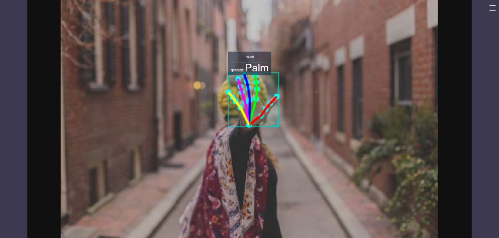

# Gesture Recognition

## Introduction

The gesture recognition algorithm example subscription package includes algorithm messages containing hand bounding boxes and hand keypoint information. It uses BPU for inference and publishes intelligent result messages containing gesture information.

The supported gesture recognition categories and their corresponding values in the algorithm message (Attribute member, with type "gesture") are as follows:

| Gesture    | Description   | Value |
| ---------- | ------------- | ----- |
| ThumbUp    | Thumbs up     | 2     |
| Victory    | "V" gesture   | 3     |
| Mute       | "Shh" gesture | 4     |
| Palm       | Palm          | 5     |
| Okay       | OK gesture    | 11    |
| ThumbLeft  | Thumb left    | 12    |
| ThumbRight | Thumb right   | 13    |
| Awesome    | "666" gesture | 14    |

Code repositories:

<https://github.com/HorizonRDK/hand_lmk_detection>

<https://github.com/HorizonRDK/hand_gesture_detection>

<https://github.com/HorizonRDK/mono2d_body_detection>

Application scenarios: Gesture recognition algorithms integrate hand keypoint detection, gesture analysis, and other technologies, enabling computers to interpret human gestures as corresponding commands. It can be used for gesture control, sign language translation, and other functions, primarily in the fields of smart homes, smart cabins, smart wearables, etc.

Example of gesture-controlled car: [4.5. Car Gesture Control — Horizon Robot Platform User Manual](../../apps/car_gesture_control)

Example of game character control based on gesture recognition and human pose analysis: [Fun with X3, Combining Fitness with Games](https://developer.horizon.cc/forumDetail/112555512834430487)

## Supported Platforms

| Platform                             | Operating System | Example Function                                 |
| ------------------------------------ | ---------------- | ------------------------------------------------ |
| RDK X3, RDK X3 Module, RDK Ultra     | Ubuntu 20.04     | · Start MIPI/USB camera and display inference results via web |

## Preparations

### Horizon RDK Platform

1. Horizon RDK is preloaded with Ubuntu 20.04 system image provided by Horizon.

2. TogetheROS.Bot has been successfully installed on Horizon RDK.3. The Horizon RDK is installed with a MIPI or USB camera.

4. Confirm that the PC can access the Horizon RDK through the network.

## User Guide

The gesture recognition package (hand_gesture_detection) subscribes to the hand key point detection package and publishes the hand key point detection results. After inference, it publishes the algorithm message. The WebSocket package is used to render and display the published images and corresponding algorithm results on the PC browser.

**Publishing Images Using MIPI Camera**

```shell
# Configure the tros.b environment
source /opt/tros/setup.bash

# Copy the required configuration files from the installation path of tros.b
cp -r /opt/tros/lib/mono2d_body_detection/config/ .
cp -r /opt/tros/lib/hand_lmk_detection/config/ .
cp -r /opt/tros/lib/hand_gesture_detection/config/ .

# Configure the MIPI camera
export CAM_TYPE=mipi

# Launch the launch file
ros2 launch hand_gesture_detection hand_gesture_detection.launch.py
```

**Publishing Images Using USB Camera**

```shell
# Configure the tros.b environment
source /opt/tros/setup.bash

# Copy the required configuration files from the installation path of tros.b
cp -r /opt/tros/lib/mono2d_body_detection/config/ .
cp -r /opt/tros/lib/hand_lmk_detection/config/ .
cp -r /opt/tros/lib/hand_gesture_detection/config/ .

# Configure the USB camera
export CAM_TYPE=usb

# Launch the launch file
ros2 launch hand_gesture_detection hand_gesture_detection.launch.py
```

## Analysis of Results

The following information will be displayed in the terminal output:

```shell
[hand_gesture_detection-5] [C][32711][08-12][09:39:39:575][configuration.cpp:49][EasyDNN]EasyDNN version: 0.4.11[hand_gesture_detection-5] [DNN] Runtime version = 1.9.7_(3.14.5 HBRT)
[hand_gesture_detection-5] [WARN] [1660268379.611419981] [hand gesture det node]: input_idx: 0, tensorType = 8, tensorLayout = 0
[hand_gesture_detection-5] [WARN] [1660268379.619313022] [hand gesture det node]: Create subscription with topic_name: /hobot_hand_lmk_detection
[hand_gesture_detection-5] [WARN] [1660268379.629207314] [hand gesture det node]: ai_msg_pub_topic_name: /hobot_hand_gesture_detection
[mono2d_body_detection-3] (MOTMethod.cpp:39): MOTMethod::Init config/iou2_euclid_method_param.json
[mono2d_body_detection-3] 
[mono2d_body_detection-3] (IOU2.cpp:34): IOU2 Mot::Init config/iou2_euclid_method_param.json
[mono2d_body_detection-3] 
[mono2d_body_detection-3] (MOTMethod.cpp:39): MOTMethod::Init config/iou2_method_param.json
[mono2d_body_detection-3] 
[mono2d_body_detection-3] (IOU2.cpp:34): IOU2 Mot::Init config/iou2_method_param.json
[mono2d_body_detection-3] 
[mono2d_body_detection-3] (MOTMethod.cpp:39): MOTMethod::Init config/iou2_method_param.json
[mono2d_body_detection-3] 
[mono2d_body_detection-3] (IOU2.cpp:34): IOU2 Mot::Init config/iou2_method_param.json
[mono2d_body_detection-3] 
[mono2d_body_detection-3] (MOTMethod.cpp:39): MOTMethod::Init config/iou2_method_param.json
[mono2d_body_detection-3] 
[mono2d_body_detection-3] (IOU2.cpp:34): IOU2 Mot::Init config/iou2_method_param.json
[mono2d_body_detection-3] 
[hand_gesture_detection-5] [WARN] [1660268381.026173815] [hand_gesture_det]: Sub smart fps 31.16
[hand_gesture_detection-5] [WARN] [1660268381.206196565] [hand_gesture_det]: Pub smart fps 30.17
[hand_gesture_detection-5] [WARN] [1660268382.054034899] [hand_gesture_det]: Sub smart fps 30.19
[hand_gesture_detection-5] [WARN] [1660268382.234087357] [hand_gesture_det]: Pub smart fps 30.19
[hand_gesture_detection-5] [WARN] [1660268383.055988982] [hand_gesture_det]: Sub smart fps 29.97
[hand_gesture_detection-5] [WARN] [1660268383.235230316] [hand_gesture_det]: Pub smart fps 30.00
[hand_gesture_detection-5] [WARN] [1660268384.087152150] [hand_gesture_det]: Sub smart fps 30.10
[hand_gesture_detection-5] [WARN] [1660268384.256141566] [hand_gesture_det]: Pub smart fps 30.39
```

The output log shows that the program runs successfully, with an input and output frame rate of 30fps during inference, and the statistics of frame rate are refreshed once per second.

The output log shows that the subscribed algorithm message includes hand information (including the bounding box and key points detection results of the hand), and the gesture recognition algorithm outputs a gesture classification result of "Palm" (the classification result is 5).

On the PC side, enter http://IP:8000 in the browser to view the image and the rendering effect of the algorithm (where IP is the IP address of the Horizon RDK).

