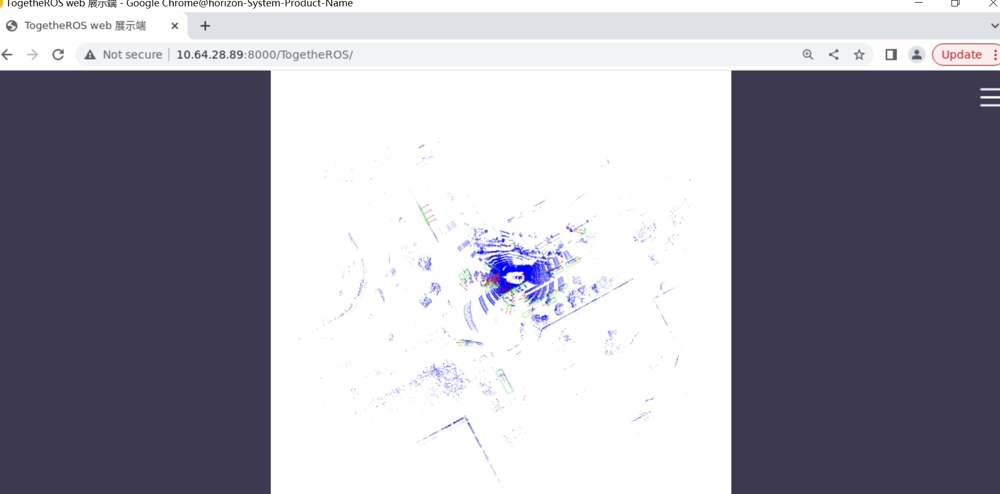

# LiDAR Target Detection Algorithm

## Introduction

The LiDAR target detection algorithm is a `CenterPoint` algorithm model trained on the [nuscenes](https://www.nuscenes.org/nuscenes) dataset.

The algorithm takes 32-line LiDAR point cloud data as input and outputs information including the 3D detection box, confidence, and category of the detected targets. The supported target detection types include car, truck, bus, barrier, motorcycle, and pedestrian, totaling six categories.

This example uses local LiDAR point cloud files as input, utilizes BPU for algorithm inference, and publishes rendered image messages containing point cloud data, target detection boxes, and orientations. The algorithm results are rendered and displayed on a PC browser.

Code repository: <https://github.com/HorizonRDK/hobot_centerpoint>

## Supported Platforms

| Platform  | System | Function                  |
| --------- | ------------ | --------------------------------------- |
| RDK Ultra | Ubuntu 20.04 | Local data and web rendering of algorithm results |

## Preparation

### Horizon RDK

1. Horizon RDK with pre-installed Ubuntu 20.04 system image.

2. TogetheROS.Bot successfully installed on the Horizon RDK.

3. Confirm that the PC can access the Horizon RDK through the network.

## Usage

### Horizon RDK

### Local Point Cloud data offline

The LiDAR target detection algorithm example uses local LiDAR point cloud file. After inference, the algorithm results are rendered as images and published along with the corresponding algorithm results for display on a PC browser using the WebSocket package.

Prepare the LiDAR point cloud files:

```shell
# Download the point cloud files for playback on the board
wget http://sunrise.horizon.cc/TogetheROS/data/hobot_centerpoint_data.tar.gz

# Unzip the file
mkdir config
tar -zxvf hobot_centerpoint_data.tar.gz -C config
# After unzipping, the data is located in the config/hobot_centerpoint_data directory
```Algorithm Example:

```shell
# Configure tros.b environment
source /opt/tros/setup.bash

# Launch the websocket service
ros2 launch websocket websocket_service.launch.py

# Launch the launch file
ros2 launch hobot_centerpoint hobot_centerpoint_websocket.launch.py lidar_pre_path:=config/hobot_centerpoint_data
```

## Result Analysis

After launching the algorithm example, the following information will be printed in the terminal:

```text
[INFO] [launch]: Default logging verbosity is set to INFO
[INFO] [hobot_centerpoint-1]: process started with pid [22470]
[INFO] [websocket-2]: process started with pid [22472]
[hobot_centerpoint-1] [WARN] [0948485758.916907430] [centerpoint_node]:
[hobot_centerpoint-1]  preprocess_config: config/centerpoint_preprocess_5dim.json
[hobot_centerpoint-1]  model_file: config/model/model.hbm
[hobot_centerpoint-1]  lidar_list_file: ./config/nuscenes_lidar_val.lst
[hobot_centerpoint-1]  is_show: 1
[hobot_centerpoint-1]  is_loop: 1
[hobot_centerpoint-1]  pub_topic_name: /hobot_centerpoint
[hobot_centerpoint-1]  lidar_pre_path: ./config/hobot_centerpoint_data
[hobot_centerpoint-1] [BPU_PLAT]BPU Platform Version(1.3.3)!
[hobot_centerpoint-1] [HBRT] set log level as 0. version = 3.14.25.0
[hobot_centerpoint-1] [DNN] Runtime version = 1.12.3_(3.14.25 HBRT)
[hobot_centerpoint-1] [WARN] [0948485759.205674972] [dnn]: Run default SetOutputParser.
[hobot_centerpoint-1] [WARN] [0948485759.205820889] [dnn]: Set output parser with default dnn node parser, you will get all output tensors and should parse output_tensors in PostProcess.
[hobot_centerpoint-1] [WARN] [0948485759.208895472] [hobot_centerpoint]: A total of 81 files were fetched!
[hobot_centerpoint-1] [WARN] [0948485759.400904472] [CenterPoint_Node]: input fps: -1.00, out fps: -1.00, infer time ms: 61, post process time ms: 57
[hobot_centerpoint-1] [WARN] [0948485759.839328014] [CenterPoint_Node]: input fps: -1.00, out fps: -1.00, infer time ms: 27, post process time ms: 53
[hobot_centerpoint-1] [WARN] [0948485760.281992264] [CenterPoint_Node]: input fps: -1.00, out fps: -1.00, infer time ms: 28, post process time ms: 53
[hobot_centerpoint-1] [WARN] [0948485760.731948223] [CenterPoint_Node]: input fps: 2.93, out fps: 3.01, infer time ms: 27, post process time ms: 56
[hobot_centerpoint-1] [WARN] [0948485761.155906223] [CenterPoint_Node]: input fps: 2.93, out fps: 3.01, infer time ms: 28, post process time ms: 56
[hobot_centerpoint-1] [WARN] [0948485761.572980640] [CenterPoint_Node]: input fps: 2.93, out fps: 3.01, infer time ms: 27, post process time ms: 53
[hobot_centerpoint-1] [WARN] [0948485761.983718973] [CenterPoint_Node]: input fps: 2.40, out fps: 2.40, infer time ms: 28, post process time ms: 55
[hobot_centerpoint-1] [WARN] [0948485762.396930973] [CenterPoint_Node]: input fps: 2.40, out fps: 2.40, infer time ms: 28, post process time ms: 55
[hobot_centerpoint-1] [WARN] [0948485762.816782057] [CenterPoint_Node]: input fps: 2.40, out fps: 2.40, infer time ms: 27, post process time ms: 56
[hobot_centerpoint-1] [WARN] [0948485763.239294099] [CenterPoint_Node]: input fps: 2.39, out fps: 2.39, infer time ms: 27, post process time ms: 57
[hobot_centerpoint-1] [WARN] [0948485763.661555807] [CenterPoint_Node]: input fps: 2.39, out fps: 2.39, infer time ms: 27, post process time ms: 57
[hobot_centerpoint-1] [WARN] [0948485764.084410183] [CenterPoint_Node]: input fps: 2.39, out fps: 2.39, infer time ms: 27, post process time ms: 57
[hobot_centerpoint-1] [WARN] [0948485764.502788849] [CenterPoint_Node]: input fps: 2.37, out fps: 2.37, infer time ms: 27, post process time ms: 55
```

The log output shows that the topic for publishing algorithm inference results is `/hobot_centerpoint`, and 81 point cloud files are obtained offline. The algorithm goes through inference and post-processing (including rendering and publishing of inference results), with a frame rate of approximately 2.4fps.

To view the image and algorithm rendering effect, please enter http://IP:8000 in the browser on the PC side (IP refers to the IP address of RDK):

