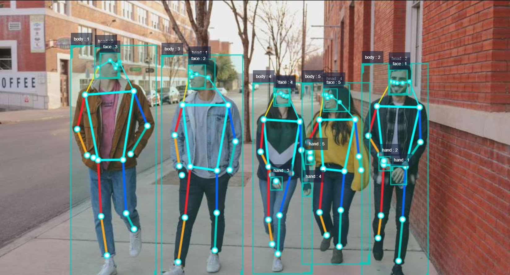

# Human Detection and Tracking

## Introduction

The human detection and tracking algorithm example subscribes to images and utilizes BPU for inference. It publishes messages containing detection results for human bodies, heads, faces, hand boxes, and body keypoints, and achieves tracking of detection boxes through the multi-target tracking (MOT). The X86 does not currently support multi-target tracking and web-based display.

The supported detection categories and their corresponding data types in the algorithm are as follows:

| Category  | Description     | Data Type |
| --------- | --------------- | --------- |
| body      | body box        | Roi       |
| head      | head box        | Roi       |
| face      | face box        | Roi       |
| hand      | hand box        | Roi       |
| body_kps  | body keypoints | Point     |

The index of the body keypoints algorithm result is shown in the following figure:


Code Repository: <https://github.com/HorizonRDK/mono2d_body_detection>

Application Scenarios: Human detection and tracking algorithms are an important component of human motion visual analysis, which can achieve functions such as human pose analysis and people counting. They are mainly applied in fields like human-computer interaction and gaming entertainment.

Pose Detection Example: [4.3 Pose Detection](../../apps/fall_detection)    
Human Tracking for Car Example: [4.4 Car Tracking](../../apps/car_tracking)  
Game Character Control Example based on Human Pose Analysis and Gesture Recognition: [Playing with X3, Combines Fitness and Gaming](https://developer.horizon.cc/forumDetail/112555512834430487)

## Supported Platforms

| Platform                            | System | Function                                     |
| ----------------------------------- | -------------- | -------------------------------------------------------- |
| RDK X3, RDK X3 Module, RDK Ultra    | Ubuntu 20.04   | · Start MIPI/USB camera/local video and display inference rendering results via web      |
| X86                                 | Ubuntu 20.04   | · Start local video offline and display inference rendering results via web                |

## Preparation

### Horizon RDK

1. Horizon RDK has flashed the Ubuntu 20.04 system image provided by Horizon.

2. Horizon RDK has successfully installed TogetheROS.Bot.

3. Horizon RDK has installed the MIPI or USB camera.

4. Confirm that the PC is able to access the Horizon RDK via the network.

### X86 Platform

1. X86 environment has been configured with Ubuntu 20.04 system image.

2. The tros.b has been successfully installed in X86.

## Usage

The mono2d_body_detection package for human detection and tracking subscribes to images published by the sensor package, performs inference, and publishes algorithm messages. The websocket package is used to render and display the images and corresponding algorithm results on a PC browser.

### Horizon RDK Platform

**Use MIPI Camera to Publish Images**

```shell
# Configure the tros.b environment
source /opt/tros/setup.bash

# Copy the required configuration files from the installation path of tros.b
cp -r /opt/tros/lib/mono2d_body_detection/config/ .

# Configure the MIPI camera
export CAM_TYPE=mipi

# Launch the launch file
ros2 launch mono2d_body_detection mono2d_body_detection.launch.py
```

**Use USB Camera to Publish Images**

```shell
# Configure the tros.b environment
source /opt/tros/setup.bash

# Copy the required configuration files from the installation path of tros.b
cp -r /opt/tros/lib/mono2d_body_detection/config/ .

# Configure the USB camera
export CAM_TYPE=usb

# Launch the launch file
ros2 launch mono2d_body_detection mono2d_body_detection.launch.py
```

**Use Local Image Offline**

```shell
# Configure the tros.b environment
source /opt/tros/setup.bash# Copy the configuration files required for running the example from the installation path of tros.b.
cp -r /opt/tros/lib/mono2d_body_detection/config/ .
cp -r /opt/tros/lib/dnn_node_example/config/ .

# Configure the local playback image.
export CAM_TYPE=fb

# Start the launch file.
ros2 launch mono2d_body_detection mono2d_body_detection.launch.py

# For RDK Ultra, specify the playback image, for example:
# ros2 launch mono2d_body_detection mono2d_body_detection.launch.py picture:=./config/target.jpg
```

### X86

**Use Local Image Offline**

```shell
# Configure the tros.b environment
source /opt/tros/setup.bash

# Copy the configuration files required for running the example from the installation path of tros.b.
cp -r /opt/tros/lib/mono2d_body_detection/config/ .
cp -r /opt/tros/lib/dnn_node_example/config/ .

# Configure the local playback image.
export CAM_TYPE=fb

# Start the launch file.
ros2 launch mono2d_body_detection mono2d_body_detection.launch.py
```

## Result analysis

The following information is outputted in the terminal:

```shell
[mono2d_body_detection-3] [WARN] [1660219823.214730286] [example]: This is mono2d body det example!
[mono2d_body_detection-3] [WARN] [1660219823.417856952] [mono2d_body_det]: Parameter:
[mono2d_body_detection-3]  is_sync_mode_: 0
[mono2d_body_detection-3]  model_file_name_: config/multitask_body_head_face_hand_kps_960x544.hbm
[mono2d_body_detection-3]  is_shared_mem_sub: 1
[mono2d_body_detection-3]  ai_msg_pub_topic_name: /hobot_mono2d_body_detection
[mono2d_body_detection-3] [C][31082][08-11][20:10:23:425][configuration.cpp:49][EasyDNN]EasyDNN version: 0.4.11
[mono2d_body_detection-3] [BPU_PLAT]BPU Platform Version(1.3.1)!
[mono2d_body_detection-3] [HBRT] set log level as 0. version = 3.14.5
[mono2d_body_detection-3] [DNN] Runtime version = 1.9.7_(3.14.5 HBRT)
[mono2d_body_detection-3] [WARN] [1660219823.545293244] [mono2d_body_det]: Create hbmem_subscription with topic_name: /hbmem_img
[mono2d_body_detection-3] (MOTMethod.cpp:39): MOTMethod::Init config/iou2_euclid_method_param.json
[mono2d_body_detection-3] 
[mono2d_body_detection-3] (IOU2.cpp:34): IOU2 Mot::Init config/iou2_euclid_method_param.json
[mono2d_body_detection-3] 
[mono2d_body_detection-3] (MOTMethod.cpp:39): MOTMethod::Init config/iou2_method_param.json
[mono2d_body_detection-3] 
[mono2d_body_detection-3] (IOU2.cpp:34): IOU2 Mot::Init config/iou2_method_param.json
[mono2d_body_detection-3] 
[mono2d_body_detection-3] (MOTMethod.cpp:39): MOTMethod::Init config/iou2_method_param.json
[mono2d_body_detection-3] 
[mono2d_body_detection-3] (IOU2.cpp:34): IOU2 Mot::Init config/iou2_method_param.json
[mono2d_body_detection-3] 
[mono2d_body_detection-3] (MOTMethod.cpp:39): MOTMethod::Init config/iou2_method_param.json
[mono2d_body_detection-3] 
[mono2d_body_detection-3] (IOU2.cpp:34): IOU2 Mot::Init config/iou2_method_param.json
[mono2d_body_detection-3] 
[mono2d_body_detection-3] [WARN] [1660219824.895102286] [mono2d_body_det]: input fps: 31.34, out fps: 31.22
[mono2d_body_detection-3] [WARN] [1660219825.921873870] [mono2d_body_det]: input fps: 30.16, out fps: 30.21
[mono2d_body_detection-3] [WARN] [1660219826.922075496] [mono2d_body_det]: input fps: 30.16, out fps: 30.00
[mono2d_body_detection-3] [WARN] [1660219827.955463330] [mono2d_body_det]: input fps: 30.01, out fps: 30.01
[mono2d_body_detection-3] [WARN] [1660219828.955764872] [mono2d_body_det]: input fps: 30.01, out fps: 30.00
```

The log shows that frame rates of the algorithm during inference are 30fps, and the statistics are refreshed every second.

On the PC browser, enter http://IP:8000 to view the rendering effect of the image and the algorithm (body, head, face, and hand detection boxes, detection box type and target tracking ID, and human body keypoints) (IP is the IP address of the Horizon RDK/X86 device):

